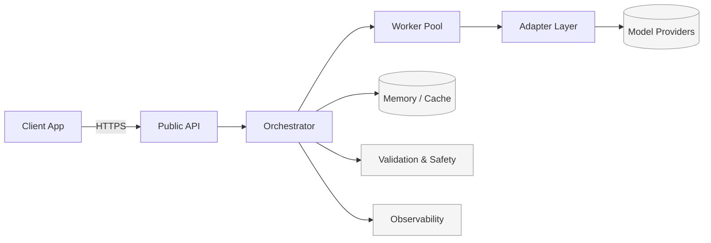

# Architecture Overview (High-Level)

This is a conceptual view of a CORE PACT–style system. It abstracts away proprietary algorithms and internal control logic. Boxes and arrows illustrate responsibilities and data flow at a public-safe level.

Diagram Source
- The Mermaid block below is intentionally high-level and suitable for public sharing.

Key Concepts
- Public API: Receives requests, validates inputs, and brokers responses back to clients.
- Orchestrator: Coordinates work across a pool of workers; applies public policies and routing at a conceptual level (no internal logic exposed).
- Worker Pool: Executes tasks and interacts with provider adapters.
- Adapter Layer: Normalizes interactions across LLM/model providers and tools.
- Memory & Cache: High-level memory and caching for performance and coherence.
- Validation & Safety: Applies public-safe checks, rate limits, and policy enforcement.
- Observability: Metrics and logs appropriate for system health (no sensitive content).

Mermaid (conceptual)

Data Handling (Public-safe)
- Only high-level metadata should be surfaced publicly.
- Sensitive data must not be logged in public artifacts.
- Provider credentials and network details are never stored here.

Out of Scope (for this repo)
- Internal arbitration, scoring, or consensus algorithms
- Proprietary prompts or orchestration logic
- Infrastructure and deployment specifics
